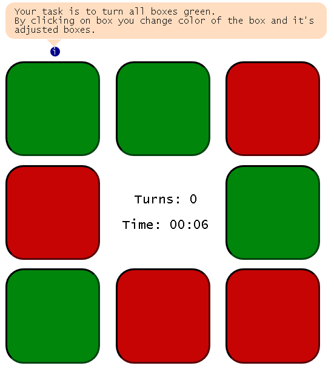
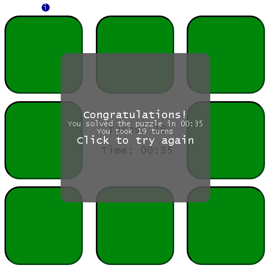
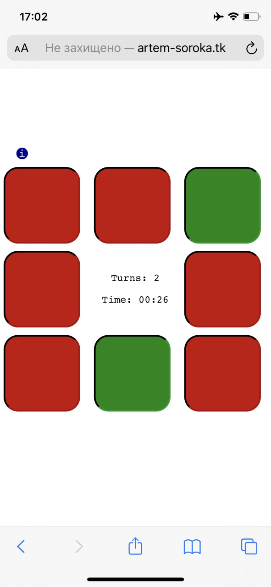

# Puzzle

### Rules
8 boxes will have randomly selected color (red or green). The task is to set all boxes to green color. However, when clicking box, two boxes adjusted to it (one on each side) will also change their color to opposite.

        
This is example:     
   

Victory screen:       
    
     
### Algorithm
The algorithm is quite simple. It's build around 3 function, which run every time, when user makes a move:
- `countTurns()` Just tracks statistics.
- `changeBoxStatus()` Finds clicked and adjusted boxes and changes thier colors. Also runs the animation.
- `checkGameStatus()` Checks if all boxes are green and game is finished (shows victory screen) or continues the game (next turn).      
      
Function `createBoxes()` run only once at the start of the game.       
               
More interesting is how CSS styles are implimented. I made effort to create reapeated animation on every user move.        
Size of game field and boxes scalable for any device screen. Here is example of how it looks on mobile.
      
 
                 
To achieve this used `@media` rule, CSS variables (`var(--base-size)`) and math functions (`calc()`).     

### Test it yourself
Live version can be found [here](http://artem-soroka.tk/pages/riddle/ "Puzzle game").   
     
Thank you.